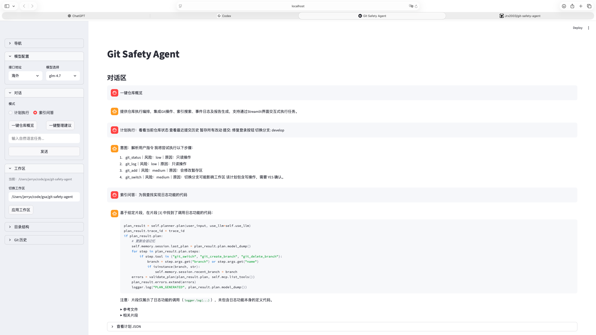
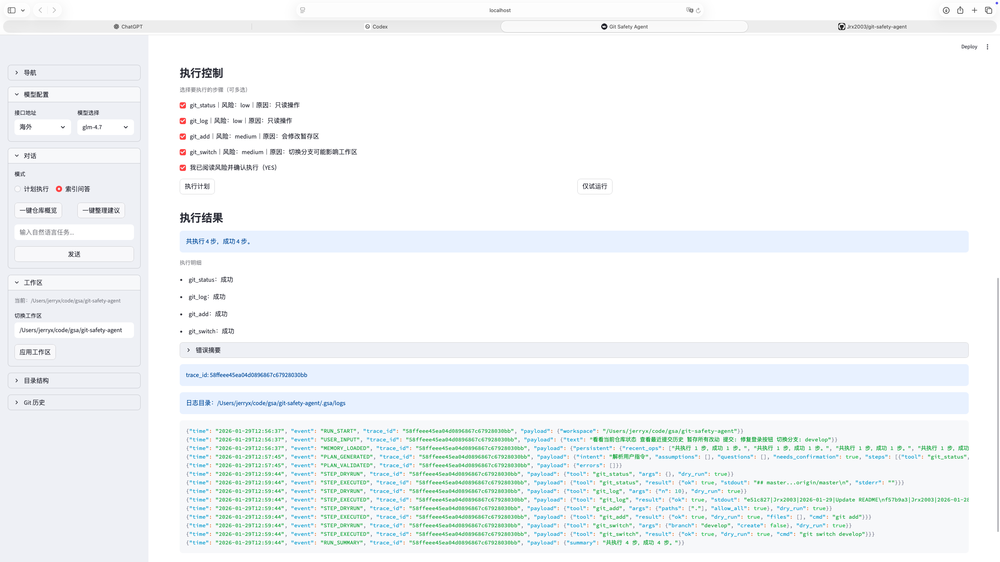
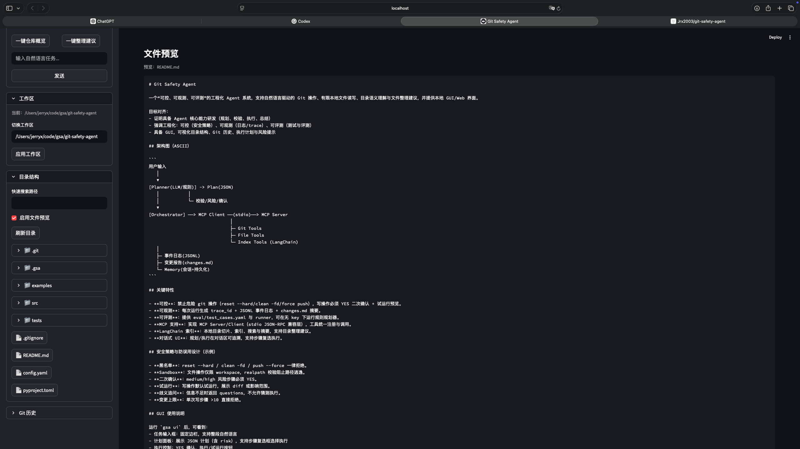

# Git Safety Agent（GSA）

一个安全优先、工程化落地的本地 Agent：将自然语言任务转成结构化计划（Plan），在校验与确认后，通过受限工具执行 Git/文件/索引相关操作，并产出可追溯的日志与变更报告。

- **可控**：危险 git 操作拦截；写操作默认 `dry-run`，需 `YES` 二次确认才会落地
- **可观测**：`trace_id`、JSONL 事件日志、`changes.md`、`last_run_summary.json`
- **可评测**：无 Key 可降级规则规划；内置评测用例与 runner
- **多入口**：CLI / Streamlit GUI / FastAPI

## 界面截图

<details>
<summary>点击展开</summary>

**对话区：自然语言输入、计划摘要与澄清追问**



**执行区：步骤选择、风险提示、YES 确认与执行结果**



**文件预览：安全沙箱内读取与预览文件内容**



</details>

## 架构图（ASCII）

```
用户输入
   │
   ▼
[Planner(LLM/规则)] -> Plan(JSON)
   │           │
   │           └─ 校验/风险/确认
   ▼
[Orchestrator] ──> MCP Client ──(stdio)──> MCP Server
                               │
                               ├─ Git Tools
                               ├─ File Tools
                               └─ Index Tools (LangChain)
   │
   ├─ 事件日志(JSONL)
   ├─ 变更报告(changes.md)
   └─ Memory(会话+持久化)
```

## 关键特性

- **可控**：禁止危险 git 操作（`reset --hard` / `clean -fd` / `push --force` 等）；写操作必须 YES 二次确认 + 试运行预览。
- **可观测**：每次运行生成 `trace_id` + JSONL 事件日志 + `changes.md` 摘要。
- **可评测**：提供 `src/gsa/eval/test_cases.yaml` 与 runner，可在无 Key 下运行规则规划器。
- **MCP 支持**：实现 MCP Server/Client（stdio JSON-RPC 兼容层），工具统一注册与调用。
- **索引能力**：本地目录切片、索引、搜索与摘要，支持目录整理建议与“索引问答”。
- **对话式 UI**：规划/执行在对话区可追溯，支持步骤复选执行。

## 目录结构（推荐面试讲法）

```
git-safety-agent/
  src/gsa/
    agent/           # Planner/Orchestrator/Schema/Memory（规划->校验->执行->总结）
    mcp/             # 最小 MCP 兼容层（stdio JSON-RPC）：server/client/registry
    tools/           # Git/File/Index 工具实现（受策略约束）
    safety/          # 风险评估、策略校验、二次确认（YES）、写操作上限
    observability/   # trace_id、JSONL 事件日志、changes 与执行摘要
    llm/             # LLM Client + Prompt（Key 缺失自动降级为规则规划）
    app/             # Streamlit GUI + FastAPI
    eval/            # 规则规划评测用例与 runner（无 Key 也能跑）
  tests/             # 单元测试（policy/risk/validator）
  examples/          # 示例输入
  images/            # README 截图
  .gsa/              # 运行产物：logs/index/memory/changes（用于可观测与可追溯）
```

## 安全策略与防误用设计（示例）

- **黑名单**：reset --hard / clean -fd / push --force 一律拒绝。
- **Sandbox**：文件操作仅限 workspace，realpath 校验阻止路径逃逸。
- **二次确认**：medium/high 风险步骤必须 YES。
- **试运行**：写操作默认试运行，展示 diff 或影响范围。
- **歧义追问**：信息不足时返回 questions，不允许猜测执行。
- **变更上限**：单次写步骤 >10 直接拒绝。

## GUI 使用说明

运行 `gsa ui`（或 `python -m gsa.cli ui`）后，可看到：
- 任务输入框：固定边栏，支持整段自然语言
- 计划面板：展示 JSON 计划（含 risk），支持步骤复选框选择执行
- 执行控制：YES 确认、执行/试运行按钮
- 建议与提示：questions/风险提示
- 目录结构：左侧树状目录（支持搜索/展开）
- Git 历史：最近提交图形日志
- 日志：trace_id 与最近日志内容
- 默认使用 LLM，如未配置 API Key 将自动降级为规则规划
- 对话模式：计划执行 / 索引问答
- 侧边栏快捷按钮：一键仓库概览 / 一键整理建议（结果写入对话区）
- 整理建议可一键转成可执行计划

界面细节：
- 输入框固定底部，覆盖主区域宽度
- 模型处理中禁止再次提交
- 仓库概览/整理建议以“对话形式”展示过程与结果

## LangChain 索引/搜索/摘要

- 加载：DirectoryLoader + TextLoader（仅文本后缀）
- 切片：RecursiveCharacterTextSplitter
- 向量库：FAISS（本地）
- 检索：相似度搜索
- 总结/建议：有 Key 时使用 LLM，无 Key 时使用规则摘要（用于 demo/可跑通）

## GLM-4.7 API Key 配置

默认模型为 `glm-4.7`（UI 可切换 `glm-4.7-flash`），使用官方 `zai-sdk` 调用。

可选配置方式（优先级：环境变量 > config.yaml）：
1) 环境变量
```
export BIGMODEL_API_KEY=""
```
或
```
export ZAI_API_KEY=""
```
2) config.yaml（留空占位）
```
# config.yaml
BIGMODEL_API_KEY: ""
```

未配置 key 时：系统使用规则规划器 + 规则摘要，保证 demo 可运行。

如需启用最新 SDK（推荐）：
```
pip install zai-sdk
```

注意：启动 UI 的 Python 环境必须与安装 zai-sdk 的环境一致。

高级配置（可选，写在 config.yaml 或环境变量）：
```
GLM_BASE_URL: "https://api.z.ai/api/paas/v4/"   # 或 https://open.bigmodel.cn/api/paas/v4/
GLM_MODEL: "glm-4.7"          # 可改为 glm-4.7-flash
GLM_TIMEOUT: 300
GLM_CONNECT_TIMEOUT: 8
GLM_MAX_RETRIES: 2
GLM_MAX_TOKENS: 65536
GLM_TEMPERATURE: 1.0
GLM_THINKING_ENABLED: true
```

说明：
- 中国大陆默认使用 `https://open.bigmodel.cn/api/paas/v4/`（ZhipuAiClient）
- 海外默认使用 `https://api.z.ai/api/paas/v4/`（ZaiClient）
- 可通过环境变量 `ZAI_BASE_URL` / `BIGMODEL_BASE_URL` 覆盖
- UI 侧边栏可直接切换接口地址与模型

## 如何运行

前置：Python >= 3.10。

### 1) 安装
```
cd git-safety-agent
pip install -e .[dev]
```

### 2) CLI
```
# 生成计划
gsa plan --input "看看当前仓库状态"

# 生成并执行（需要 --yes 才会真正写）
gsa run --input "暂存所有改动" --yes

# 不使用 LLM（强制规则规划，便于离线演示/评测）
gsa plan --no-use-llm --input "查看最近提交历史"
```

### 3) GUI
```
gsa ui
```

### 4) API（可选）
```
gsa api --port 8000
```

## 如何运行测试与评测

```
pytest -q
python -m gsa.eval.runner
```

## 示例输入

更多输入示例见：`examples/demo_inputs.md`

## 失败模式与防护（至少 5 条）

1) 未配置 API Key：自动降级为规则规划/摘要。
2) 规划结果无效 JSON：解析失败后回退规则规划器。
3) 写操作未确认：仅试运行，不会修改。
4) 路径越界：realpath 校验直接拒绝。
5) 索引不存在：提示先构建索引。

## MCP 兼容范围说明

本项目实现“最小 MCP 兼容层”（stdio JSON-RPC 风格），包含：
- tools/list, tools/call
- resources/list, resources/read

可与 MCP Client 进行基本工具调用与资源读取；未覆盖完整官方协议扩展。
